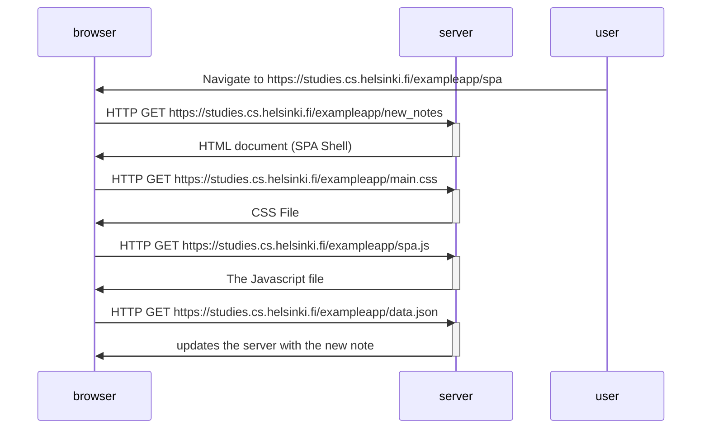

Task: Create a diagram depicting the situation where the user goes to the single-page app version of the notes app at https://studies.cs.helsinki.fi/exampleapp/spa.

What is a single-page app?

A SPA is a web app that dynamically updates as the user interacts with it, rather than loading entirely new page from the server. 

